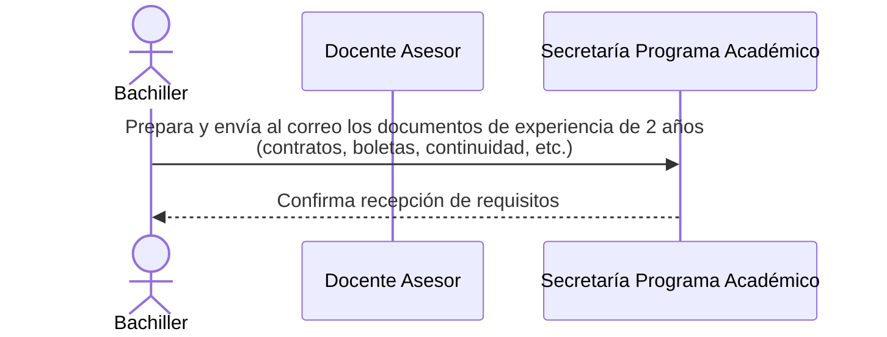
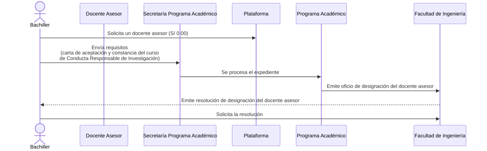
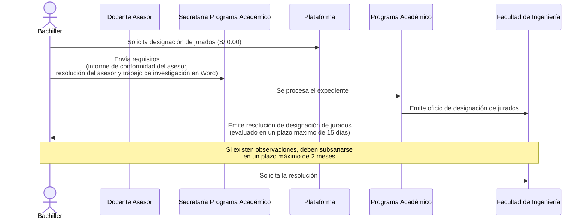
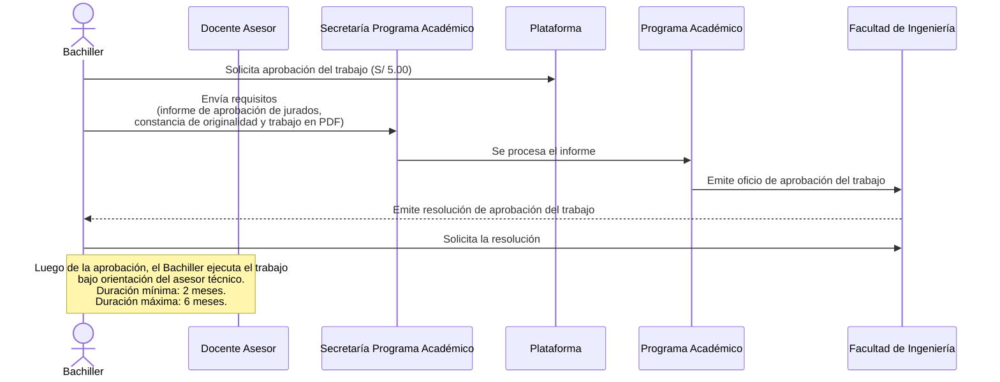
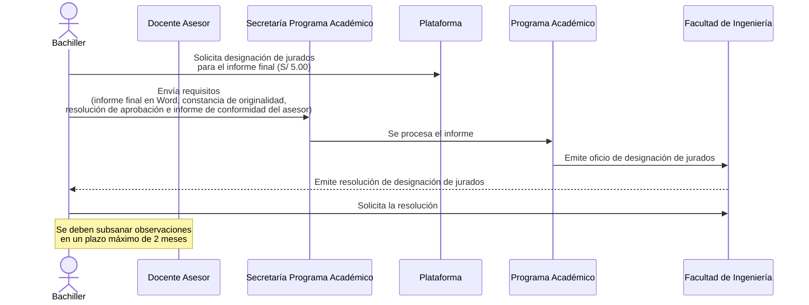
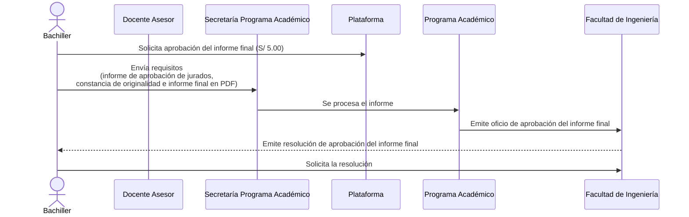
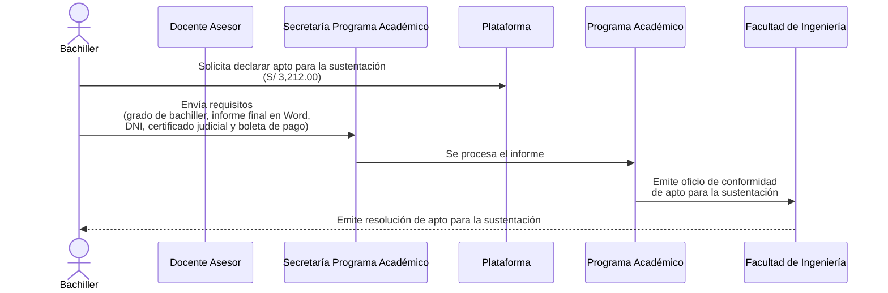
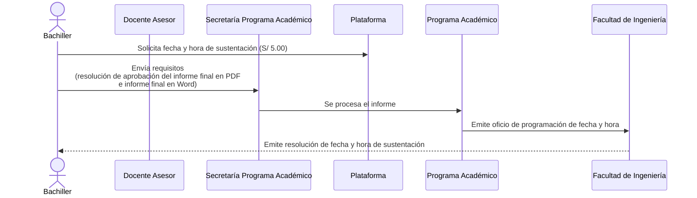
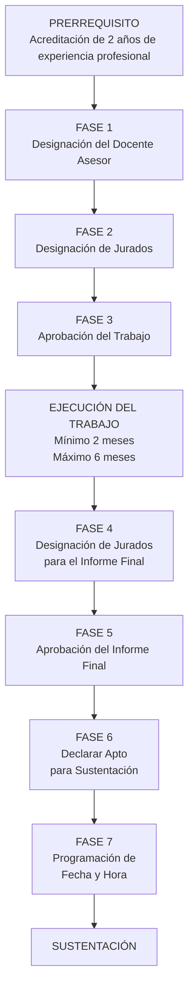
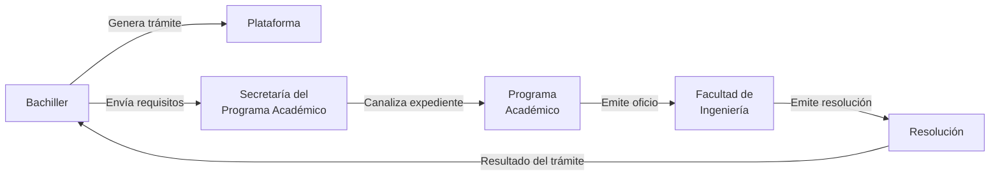

# PROCESO PARA OPTAR EL TÍTULO PROFESIONAL MEDIANTE TRABAJO DE SUFICIENCIA PROFESIONAL

> **Universidad de Huánuco (UDH)**  
> **Facultad de Ingeniería**  
> **Programa Académico de Ingeniería de Sistemas e Informática**

---

# 1. DESCRIPCIÓN GENERAL DEL PROCESO

El presente documento organiza el proceso para optar el **Título Profesional mediante la modalidad de Trabajo de Suficiencia Profesional**, considerando el **prerrequisito** y las **Fases 1 a 7** representadas en los diagramas de secuencia.

El procedimiento comprende la acreditación inicial de la experiencia profesional del bachiller, la designación del docente asesor y de los jurados, la aprobación y ejecución del trabajo, la revisión y aprobación del informe final, la declaración de aptitud para sustentación y, finalmente, la programación de la fecha y hora de sustentación.

Los principales actores que intervienen son:

- **Bachiller**
- **Docente Asesor**
- **Secretaría del Programa Académico**
- **Plataforma**
- **Programa Académico**
- **Facultad de Ingeniería**

---

# 2. ACTORES DEL PROCESO

| Actor | Función dentro del proceso |
|---|---|
| **Bachiller** | Inicia los trámites, reúne los requisitos, realiza los pagos correspondientes, remite la documentación y solicita las resoluciones cuando corresponde. |
| **Docente Asesor** | Orienta y supervisa el desarrollo del Trabajo de Suficiencia Profesional y participa mediante los informes de conformidad requeridos. |
| **Secretaría del Programa Académico** | Recibe la documentación enviada por el bachiller y canaliza el expediente para su procesamiento. |
| **Plataforma** | Medio utilizado por el bachiller para generar los trámites administrativos y efectuar los pagos correspondientes. |
| **Programa Académico** | Procesa los expedientes y emite los oficios correspondientes hacia la Facultad de Ingeniería. |
| **Facultad de Ingeniería** | Recibe los oficios emitidos por el Programa Académico y emite las resoluciones correspondientes. |

> **Consideración administrativa:** dentro de los diagramas, el **Programa Académico** interviene mediante la emisión del **oficio**, mientras que la **Facultad de Ingeniería** interviene mediante la emisión de la **resolución**.

---

# 3. PRERREQUISITO — ACREDITACIÓN DE EXPERIENCIA PROFESIONAL

Antes de iniciar las fases administrativas, el bachiller debe acreditar la experiencia profesional requerida para acogerse a la modalidad de **Trabajo de Suficiencia Profesional**.

## 3.1. Información del prerrequisito

| Elemento | Detalle |
|---|---|
| **Responsable principal** | Bachiller |
| **Entidad receptora** | Secretaría del Programa Académico |
| **Medio de presentación** | Correo electrónico |
| **Finalidad** | Acreditar la experiencia profesional requerida |
| **Experiencia requerida** | 2 años |
| **Documentación considerada** | Contratos, boletas, documentos de continuidad laboral y demás documentos que acrediten la experiencia |
| **Resultado esperado** | Confirmación de recepción de los requisitos |

## 3.2. Procedimiento detallado

1. El **Bachiller** reúne la documentación necesaria para acreditar sus **2 años de experiencia profesional**.
2. Entre los documentos considerados se encuentran:
   - Contratos.
   - Boletas.
   - Documentación que demuestre continuidad laboral.
   - Otros documentos que permitan acreditar la experiencia requerida.
3. El Bachiller prepara la documentación.
4. Envía los requisitos mediante correo electrónico a la **Secretaría del Programa Académico**.
5. La Secretaría recibe los documentos.
6. La Secretaría confirma al Bachiller la **recepción de los requisitos**.
7. Cumplido el prerrequisito, el Bachiller puede continuar con las fases administrativas siguientes.

## 3.3. Diagrama de secuencia

---

# 4. FASE 1 — DESIGNACIÓN DEL DOCENTE ASESOR

La primera fase tiene como finalidad formalizar la designación del **Docente Asesor**, quien acompañará al Bachiller durante el desarrollo del Trabajo de Suficiencia Profesional.

## 4.1. Información de la fase

| Elemento | Detalle |
|---|---|
| **Trámite** | Solicitud de docente asesor |
| **Responsable de iniciar el trámite** | Bachiller |
| **Medio de inicio** | Plataforma |
| **Pago indicado** | **S/ 0.00** |
| **Requisitos** | Carta de aceptación y constancia del curso de Conducta Responsable de Investigación |
| **Recepción de documentos** | Secretaría del Programa Académico |
| **Procesamiento** | Programa Académico |
| **Documento del Programa Académico** | Oficio de designación del docente asesor |
| **Documento de la Facultad** | Resolución de designación del docente asesor |
| **Resultado** | Docente asesor formalmente designado |

## 4.2. Requisitos

El Bachiller debe presentar:

- **Carta de aceptación.**
- **Constancia del curso de Conducta Responsable de Investigación.**

## 4.3. Procedimiento detallado

1. El **Bachiller** ingresa a la Plataforma.
2. Genera la solicitud de **designación de docente asesor**.
3. El trámite aparece con un costo de **S/ 0.00**.
4. El Bachiller prepara la carta de aceptación.
5. Adjunta la constancia del curso de Conducta Responsable de Investigación.
6. Envía los requisitos a la **Secretaría del Programa Académico**.
7. La Secretaría recibe la documentación.
8. El expediente es procesado por el **Programa Académico**.
9. El Programa Académico emite el **oficio de designación del docente asesor**.
10. El oficio es remitido a la **Facultad de Ingeniería**.
11. La Facultad emite la **resolución de designación del docente asesor**.
12. El Bachiller solicita la resolución correspondiente.
13. Con la resolución emitida, queda formalizada la designación del asesor.

## 4.4. Diagrama de secuencia

---

# 5. FASE 2 — DESIGNACIÓN DE JURADOS

Esta fase permite designar formalmente a los jurados encargados de revisar y evaluar el Trabajo de Suficiencia Profesional.

## 5.1. Información de la fase

| Elemento | Detalle |
|---|---|
| **Trámite** | Designación de jurados |
| **Responsable** | Bachiller |
| **Medio** | Plataforma |
| **Pago indicado** | **S/ 0.00** |
| **Recepción de documentos** | Secretaría del Programa Académico |
| **Procesamiento** | Programa Académico |
| **Documento del Programa Académico** | Oficio de designación de jurados |
| **Documento de la Facultad** | Resolución de designación de jurados |
| **Plazo de evaluación indicado** | Máximo **15 días** |
| **Plazo para subsanar observaciones** | Máximo **2 meses** |

## 5.2. Requisitos

El Bachiller debe presentar:

- **Informe de conformidad del asesor.**
- **Resolución del asesor.**
- **Trabajo de investigación en Word.**

## 5.3. Procedimiento detallado

1. El Bachiller ingresa a la Plataforma.
2. Solicita la **designación de jurados**.
3. El trámite aparece con un costo de **S/ 0.00**.
4. Prepara el informe de conformidad del asesor.
5. Adjunta la resolución del asesor.
6. Prepara el trabajo en formato Word.
7. Envía los requisitos a la **Secretaría del Programa Académico**.
8. La Secretaría recibe la documentación.
9. El expediente es remitido al **Programa Académico**.
10. El Programa Académico procesa el expediente.
11. Emite el **oficio de designación de jurados**.
12. El oficio es remitido a la **Facultad de Ingeniería**.
13. La Facultad emite la **resolución de designación de jurados**.
14. En el diagrama se establece un plazo máximo de evaluación de **15 días**.
15. Si existen observaciones, estas deben subsanarse en un plazo máximo de **2 meses**.
16. Después de subsanar las observaciones correspondientes, el Bachiller solicita la resolución.

## 5.4. Diagrama de secuencia

---

# 6. FASE 3 — APROBACIÓN DEL TRABAJO

Una vez realizada la evaluación correspondiente, el Bachiller inicia el procedimiento para obtener la **aprobación formal del trabajo**.

## 6.1. Información de la fase

| Elemento | Detalle |
|---|---|
| **Trámite** | Aprobación del trabajo |
| **Responsable** | Bachiller |
| **Medio** | Plataforma |
| **Pago** | **S/ 5.00** |
| **Recepción** | Secretaría del Programa Académico |
| **Procesamiento** | Programa Académico |
| **Documento del Programa Académico** | Oficio de aprobación del trabajo |
| **Documento de la Facultad** | Resolución de aprobación del trabajo |
| **Actividad posterior** | Ejecución del trabajo bajo orientación del asesor técnico |
| **Duración mínima** | **2 meses** |
| **Duración máxima** | **6 meses** |

## 6.2. Requisitos

El Bachiller debe presentar:

- **Informe de aprobación de jurados.**
- **Constancia de originalidad.**
- **Trabajo en formato PDF.**

## 6.3. Procedimiento detallado

1. El Bachiller ingresa a la Plataforma.
2. Solicita la **aprobación del trabajo**.
3. Realiza el pago de **S/ 5.00**.
4. Reúne el informe de aprobación de jurados.
5. Obtiene la constancia de originalidad.
6. Prepara el trabajo en formato PDF.
7. Envía los requisitos a la **Secretaría del Programa Académico**.
8. La Secretaría recibe la documentación.
9. El expediente es remitido al **Programa Académico**.
10. El Programa Académico procesa el informe.
11. Emite el **oficio de aprobación del trabajo**.
12. El oficio es remitido a la Facultad de Ingeniería.
13. La Facultad emite la **resolución de aprobación del trabajo**.
14. El Bachiller solicita la resolución.
15. Después de la aprobación, el Bachiller ejecuta el trabajo bajo la orientación del asesor técnico.
16. La ejecución del trabajo presenta una duración:
    - **Mínima: 2 meses.**
    - **Máxima: 6 meses.**

## 6.4. Diagrama de secuencia

---

# 7. FASE 4 — DESIGNACIÓN DE JURADOS PARA EL INFORME FINAL

Finalizada la ejecución del trabajo, corresponde solicitar la designación de los jurados encargados de evaluar el **informe final**.

## 7.1. Información de la fase

| Elemento | Detalle |
|---|---|
| **Trámite** | Designación de jurados para el informe final |
| **Responsable** | Bachiller |
| **Medio** | Plataforma |
| **Pago** | **S/ 5.00** |
| **Recepción** | Secretaría del Programa Académico |
| **Procesamiento** | Programa Académico |
| **Documento del Programa Académico** | Oficio de designación de jurados |
| **Documento de la Facultad** | Resolución de designación de jurados |
| **Subsanación de observaciones** | Máximo **2 meses** |

## 7.2. Requisitos

El Bachiller debe presentar:

- **Informe final en Word.**
- **Constancia de originalidad.**
- **Resolución de aprobación.**
- **Informe de conformidad del asesor.**

## 7.3. Procedimiento detallado

1. El Bachiller ingresa a la Plataforma.
2. Solicita la **designación de jurados para el informe final**.
3. Realiza el pago de **S/ 5.00**.
4. Prepara el informe final en formato Word.
5. Adjunta la constancia de originalidad.
6. Adjunta la resolución de aprobación.
7. Obtiene el informe de conformidad del asesor.
8. Envía todos los requisitos a la **Secretaría del Programa Académico**.
9. La Secretaría recibe la documentación.
10. El expediente es remitido al Programa Académico.
11. El Programa Académico procesa el informe.
12. Emite el **oficio de designación de jurados**.
13. El oficio es remitido a la Facultad de Ingeniería.
14. La Facultad emite la **resolución de designación de jurados**.
15. El Bachiller solicita la resolución.
16. Si los jurados formulan observaciones, estas deben subsanarse en un plazo máximo de **2 meses**.

## 7.4. Diagrama de secuencia

---

# 8. FASE 5 — APROBACIÓN DEL INFORME FINAL

Después de superar la revisión realizada por los jurados, el Bachiller gestiona la **aprobación formal del informe final**.

## 8.1. Información de la fase

| Elemento | Detalle |
|---|---|
| **Trámite** | Aprobación del informe final |
| **Responsable** | Bachiller |
| **Medio** | Plataforma |
| **Pago** | **S/ 5.00** |
| **Recepción** | Secretaría del Programa Académico |
| **Procesamiento** | Programa Académico |
| **Documento del Programa Académico** | Oficio de aprobación del informe final |
| **Documento de la Facultad** | Resolución de aprobación del informe final |
| **Resultado** | Informe final formalmente aprobado |

## 8.2. Requisitos

El Bachiller debe presentar:

- **Informe de aprobación de jurados.**
- **Constancia de originalidad.**
- **Informe final en PDF.**

## 8.3. Procedimiento detallado

1. El Bachiller ingresa a la Plataforma.
2. Solicita la **aprobación del informe final**.
3. Realiza el pago de **S/ 5.00**.
4. Obtiene el informe de aprobación de jurados.
5. Obtiene la constancia de originalidad.
6. Prepara el informe final en formato PDF.
7. Envía los requisitos a la Secretaría del Programa Académico.
8. La Secretaría recibe la documentación.
9. El expediente es remitido al Programa Académico.
10. El Programa Académico procesa el informe.
11. Emite el **oficio de aprobación del informe final**.
12. El oficio es remitido a la Facultad de Ingeniería.
13. La Facultad emite la **resolución de aprobación del informe final**.
14. El Bachiller solicita la resolución correspondiente.
15. Con la resolución emitida, el informe final queda formalmente aprobado.

## 8.4. Diagrama de secuencia

---

# 9. FASE 6 — DECLARAR APTO PARA LA SUSTENTACIÓN

Con el informe final aprobado, el Bachiller debe realizar el trámite correspondiente para ser declarado **apto para la sustentación**.

## 9.1. Información de la fase

| Elemento | Detalle |
|---|---|
| **Trámite** | Declarar apto para sustentación |
| **Responsable** | Bachiller |
| **Medio** | Plataforma |
| **Pago** | **S/ 3,212.00** |
| **Recepción** | Secretaría del Programa Académico |
| **Procesamiento** | Programa Académico |
| **Documento del Programa Académico** | Oficio de conformidad de apto para sustentación |
| **Documento de la Facultad** | Resolución de apto para sustentación |
| **Resultado** | Bachiller declarado apto para sustentación |

## 9.2. Requisitos

El Bachiller debe presentar:

- **Grado de bachiller.**
- **Informe final en Word.**
- **DNI.**
- **Certificado judicial.**
- **Boleta de pago.**

## 9.3. Procedimiento detallado

1. El Bachiller ingresa a la Plataforma.
2. Solicita ser **declarado apto para la sustentación**.
3. Realiza el pago indicado de **S/ 3,212.00**.
4. Prepara el grado de bachiller.
5. Prepara el informe final en Word.
6. Adjunta su DNI.
7. Adjunta el certificado judicial.
8. Adjunta la boleta de pago.
9. Envía los requisitos a la Secretaría del Programa Académico.
10. La Secretaría recibe la documentación.
11. El expediente es remitido al Programa Académico.
12. El Programa Académico procesa el informe.
13. Emite el **oficio de conformidad de apto para la sustentación**.
14. El oficio es remitido a la Facultad de Ingeniería.
15. La Facultad emite la **resolución de apto para la sustentación**.
16. Con la resolución emitida, el Bachiller queda habilitado para solicitar la programación de la sustentación.

## 9.4. Diagrama de secuencia

---

# 10. FASE 7 — PROGRAMACIÓN DE FECHA Y HORA DE SUSTENTACIÓN

Una vez declarado apto, el Bachiller solicita formalmente la **fecha y hora para realizar la sustentación**.

## 10.1. Información de la fase

| Elemento | Detalle |
|---|---|
| **Trámite** | Solicitud de fecha y hora de sustentación |
| **Responsable** | Bachiller |
| **Medio** | Plataforma |
| **Pago** | **S/ 5.00** |
| **Recepción** | Secretaría del Programa Académico |
| **Procesamiento** | Programa Académico |
| **Documento del Programa Académico** | Oficio de programación de fecha y hora |
| **Documento de la Facultad** | Resolución de fecha y hora de sustentación |
| **Resultado** | Sustentación formalmente programada |

## 10.2. Requisitos

El Bachiller debe presentar:

- **Resolución de aprobación del informe final en PDF.**
- **Informe final en Word.**

## 10.3. Procedimiento detallado

1. El Bachiller ingresa a la Plataforma.
2. Solicita la **fecha y hora de sustentación**.
3. Realiza el pago de **S/ 5.00**.
4. Prepara la resolución de aprobación del informe final en formato PDF.
5. Prepara el informe final en Word.
6. Envía los requisitos a la Secretaría del Programa Académico.
7. La Secretaría recibe la documentación.
8. El expediente es remitido al Programa Académico.
9. El Programa Académico procesa el informe.
10. Emite el **oficio de programación de fecha y hora**.
11. El oficio es remitido a la Facultad de Ingeniería.
12. La Facultad emite la **resolución de fecha y hora de sustentación**.
13. Con esta resolución queda formalmente establecida la programación de la sustentación.

## 10.4. Diagrama de secuencia

---

# 11. TABLA CONSOLIDADA DEL PROCESO

| Etapa | Trámite principal | Requisitos principales | Pago | Resultado |
|---|---|---|---:|---|
| **Prerrequisito** | Acreditación de experiencia profesional | Contratos, boletas, continuidad y demás documentación de experiencia de 2 años | — | Confirmación de recepción |
| **Fase 1** | Designación de docente asesor | Carta de aceptación + constancia del curso de Conducta Responsable de Investigación | **S/ 0.00** | Resolución de designación del asesor |
| **Fase 2** | Designación de jurados | Informe de conformidad + resolución del asesor + trabajo en Word | **S/ 0.00** | Resolución de designación de jurados |
| **Fase 3** | Aprobación del trabajo | Informe de aprobación + constancia de originalidad + trabajo en PDF | **S/ 5.00** | Resolución de aprobación del trabajo |
| **Fase 4** | Designación de jurados del informe final | Informe final Word + originalidad + resolución de aprobación + conformidad del asesor | **S/ 5.00** | Resolución de designación de jurados |
| **Fase 5** | Aprobación del informe final | Aprobación de jurados + originalidad + informe final PDF | **S/ 5.00** | Resolución de aprobación del informe final |
| **Fase 6** | Declarar apto para sustentación | Grado de bachiller + informe final Word + DNI + certificado judicial + boleta | **S/ 3,212.00** | Resolución de apto para sustentación |
| **Fase 7** | Programación de fecha y hora | Resolución de aprobación del informe final PDF + informe final Word | **S/ 5.00** | Resolución de fecha y hora |

---

# 12. TABLA CONSOLIDADA DE PLAZOS Y CONDICIONES

| Etapa | Plazo o condición |
|---|---|
| **Prerrequisito** | Acreditar **2 años de experiencia profesional** |
| **Fase 1** | No se especifica un plazo en el diagrama proporcionado |
| **Fase 2** | Evaluación en un plazo máximo de **15 días** |
| **Fase 2** | Subsanación de observaciones en un plazo máximo de **2 meses** |
| **Fase 3** | Ejecución del trabajo: mínimo **2 meses** y máximo **6 meses** |
| **Fase 4** | Subsanación de observaciones en un plazo máximo de **2 meses** |
| **Fase 5** | No se especifica un plazo en el diagrama proporcionado |
| **Fase 6** | No se especifica un plazo en el diagrama proporcionado |
| **Fase 7** | No se especifica un plazo en el diagrama proporcionado |

---

# 13. TABLA DE DOCUMENTOS GENERADOS

| Etapa | Documento generado por el Programa Académico | Documento generado por la Facultad de Ingeniería |
|---|---|---|
| **Prerrequisito** | No corresponde | No corresponde |
| **Fase 1** | Oficio de designación del docente asesor | Resolución de designación del docente asesor |
| **Fase 2** | Oficio de designación de jurados | Resolución de designación de jurados |
| **Fase 3** | Oficio de aprobación del trabajo | Resolución de aprobación del trabajo |
| **Fase 4** | Oficio de designación de jurados | Resolución de designación de jurados |
| **Fase 5** | Oficio de aprobación del informe final | Resolución de aprobación del informe final |
| **Fase 6** | Oficio de conformidad de apto para sustentación | Resolución de apto para sustentación |
| **Fase 7** | Oficio de programación de fecha y hora | Resolución de fecha y hora de sustentación |

---

# 14. CHECKLIST GENERAL DEL BACHILLER

## Prerrequisito

- [ ] Reunir documentos que acrediten 2 años de experiencia.
- [ ] Adjuntar contratos.
- [ ] Adjuntar boletas.
- [ ] Acreditar continuidad laboral.
- [ ] Enviar documentación a la Secretaría del Programa Académico.
- [ ] Obtener confirmación de recepción.

## Fase 1

- [ ] Obtener carta de aceptación.
- [ ] Obtener constancia del curso de Conducta Responsable de Investigación.
- [ ] Generar solicitud de docente asesor.
- [ ] Enviar requisitos.
- [ ] Esperar el procesamiento del expediente.
- [ ] Obtener resolución de designación del asesor.

## Fase 2

- [ ] Obtener informe de conformidad del asesor.
- [ ] Contar con resolución del asesor.
- [ ] Preparar trabajo en Word.
- [ ] Solicitar designación de jurados.
- [ ] Enviar requisitos.
- [ ] Atender observaciones, si existen.
- [ ] Obtener resolución de designación de jurados.

## Fase 3

- [ ] Obtener informe de aprobación de jurados.
- [ ] Obtener constancia de originalidad.
- [ ] Preparar trabajo en PDF.
- [ ] Solicitar aprobación del trabajo.
- [ ] Pagar **S/ 5.00**.
- [ ] Enviar requisitos.
- [ ] Obtener resolución de aprobación.
- [ ] Ejecutar el trabajo bajo orientación del asesor.
- [ ] Cumplir el periodo mínimo de 2 meses y máximo de 6 meses.

## Fase 4

- [ ] Preparar informe final en Word.
- [ ] Obtener constancia de originalidad.
- [ ] Contar con resolución de aprobación.
- [ ] Obtener informe de conformidad del asesor.
- [ ] Solicitar designación de jurados.
- [ ] Pagar **S/ 5.00**.
- [ ] Enviar requisitos.
- [ ] Subsanar observaciones, si corresponde.
- [ ] Obtener resolución de designación de jurados.

## Fase 5

- [ ] Obtener informe de aprobación de jurados.
- [ ] Obtener constancia de originalidad.
- [ ] Preparar informe final en PDF.
- [ ] Solicitar aprobación del informe final.
- [ ] Pagar **S/ 5.00**.
- [ ] Enviar requisitos.
- [ ] Obtener resolución de aprobación del informe final.

## Fase 6

- [ ] Contar con grado de bachiller.
- [ ] Preparar informe final en Word.
- [ ] Adjuntar DNI.
- [ ] Adjuntar certificado judicial.
- [ ] Realizar el pago de **S/ 3,212.00**.
- [ ] Adjuntar boleta de pago.
- [ ] Solicitar ser declarado apto.
- [ ] Enviar requisitos.
- [ ] Obtener resolución de apto para sustentación.

## Fase 7

- [ ] Contar con resolución de aprobación del informe final en PDF.
- [ ] Preparar informe final en Word.
- [ ] Solicitar fecha y hora de sustentación.
- [ ] Pagar **S/ 5.00**.
- [ ] Enviar requisitos.
- [ ] Obtener resolución de fecha y hora.
- [ ] Presentarse a la sustentación en la fecha programada.

---

# 15. FLUJO GENERAL DEL PROCESO

---

# 16. FLUJO ADMINISTRATIVO GENERAL

De manera general, las fases administrativas siguen la siguiente estructura:

Este esquema permite identificar dos rutas paralelas iniciadas por el Bachiller:

1. **Ruta del trámite:** Bachiller → Plataforma.
2. **Ruta documental:** Bachiller → Secretaría del Programa Académico → Programa Académico → Facultad de Ingeniería → Bachiller.

---

# 17. RESUMEN GENERAL DEL PROCESO

El procedimiento comienza con un **prerrequisito**, mediante el cual el Bachiller debe acreditar **2 años de experiencia profesional**. Para ello reúne contratos, boletas y documentación relacionada con su continuidad y experiencia laboral, remitiendo estos documentos a la Secretaría del Programa Académico.

Una vez acreditada la experiencia, se inicia la **Fase 1**, correspondiente a la **designación del Docente Asesor**. El Bachiller genera el trámite mediante la Plataforma, presenta la carta de aceptación y la constancia del curso de Conducta Responsable de Investigación. El expediente es procesado por el Programa Académico y culmina con la resolución de designación emitida por la Facultad de Ingeniería.

En la **Fase 2**, el Bachiller solicita la **designación de jurados**, presentando el informe de conformidad del asesor, la resolución del asesor y el trabajo en Word. Los jurados realizan la evaluación correspondiente, señalándose en el diagrama un plazo máximo de **15 días**. Si existen observaciones, estas deben subsanarse en un plazo máximo de **2 meses**.

Superada esta evaluación, se desarrolla la **Fase 3**, correspondiente a la **aprobación del trabajo**. El Bachiller presenta el informe de aprobación de los jurados, la constancia de originalidad y el trabajo en PDF. Una vez obtenida la resolución de aprobación, procede con la ejecución del trabajo bajo la orientación del asesor técnico. Esta etapa presenta una duración mínima de **2 meses** y máxima de **6 meses**.

Finalizada la ejecución, se inicia la **Fase 4**, en la que se solicita la **designación de jurados para el informe final**. El Bachiller presenta el informe final en Word, la constancia de originalidad, la resolución de aprobación y el informe de conformidad del asesor. Los jurados revisan el informe y, en caso de existir observaciones, estas deben ser subsanadas dentro de un plazo máximo de **2 meses**.

Después de superar la revisión se desarrolla la **Fase 5**, correspondiente a la **aprobación del informe final**. Para ello se presenta el informe de aprobación de jurados, la constancia de originalidad y el informe final en PDF. El Programa Académico procesa el expediente, emite el oficio correspondiente y la Facultad de Ingeniería emite la resolución de aprobación del informe final.

Con el informe final aprobado, el Bachiller continúa con la **Fase 6**, denominada **Declarar apto para la sustentación**. En esta fase presenta el grado de bachiller, informe final en Word, DNI, certificado judicial y boleta de pago. El trámite presenta en el diagrama un pago de **S/ 3,212.00**. El Programa Académico emite el oficio de conformidad y la Facultad de Ingeniería emite la resolución mediante la cual el Bachiller queda declarado apto para sustentación.

Finalmente, en la **Fase 7**, el Bachiller solicita la **programación de fecha y hora de sustentación**. Presenta la resolución de aprobación del informe final en PDF y el informe final en Word, además de realizar el pago indicado de **S/ 5.00**. El Programa Académico procesa la solicitud y emite el oficio de programación, mientras que la Facultad de Ingeniería emite la resolución mediante la cual se establece formalmente la fecha y hora de sustentación.

---

# 18. RESUMEN SECUENCIAL

El proceso completo puede sintetizarse de la siguiente manera:

> **PRERREQUISITO**  
> Acreditación de 2 años de experiencia profesional  
>
> ↓  
>
> **FASE 1**  
> Designación del Docente Asesor  
>
> ↓  
>
> **FASE 2**  
> Designación de Jurados  
>
> ↓  
>
> **FASE 3**  
> Aprobación del Trabajo  
>
> ↓  
>
> **EJECUCIÓN DEL TRABAJO**  
> Mínimo 2 meses — Máximo 6 meses  
>
> ↓  
>
> **FASE 4**  
> Designación de Jurados para el Informe Final  
>
> ↓  
>
> **FASE 5**  
> Aprobación del Informe Final  
>
> ↓  
>
> **FASE 6**  
> Declarar Apto para la Sustentación  
>
> ↓  
>
> **FASE 7**  
> Programación de Fecha y Hora  
>
> ↓  
>
> **SUSTENTACIÓN**

---

# 19. RESULTADO FINAL DEL PROCESO

Al completar satisfactoriamente el **prerrequisito y las siete fases**, el Bachiller habrá realizado la secuencia administrativa necesaria para llegar a la **sustentación del Trabajo de Suficiencia Profesional**.

La lógica general del procedimiento es:

**Acreditar experiencia → Obtener asesor → Obtener jurados → Aprobar el trabajo → Ejecutar el trabajo → Obtener jurados para el informe final → Aprobar el informe final → Ser declarado apto → Obtener fecha y hora → Sustentar.**

El flujo administrativo mantiene como estructura general que el **Bachiller inicia los trámites y presenta los requisitos**, la **Secretaría del Programa Académico recibe y canaliza la documentación**, el **Programa Académico procesa el expediente y emite el oficio**, y la **Facultad de Ingeniería emite la resolución correspondiente**.