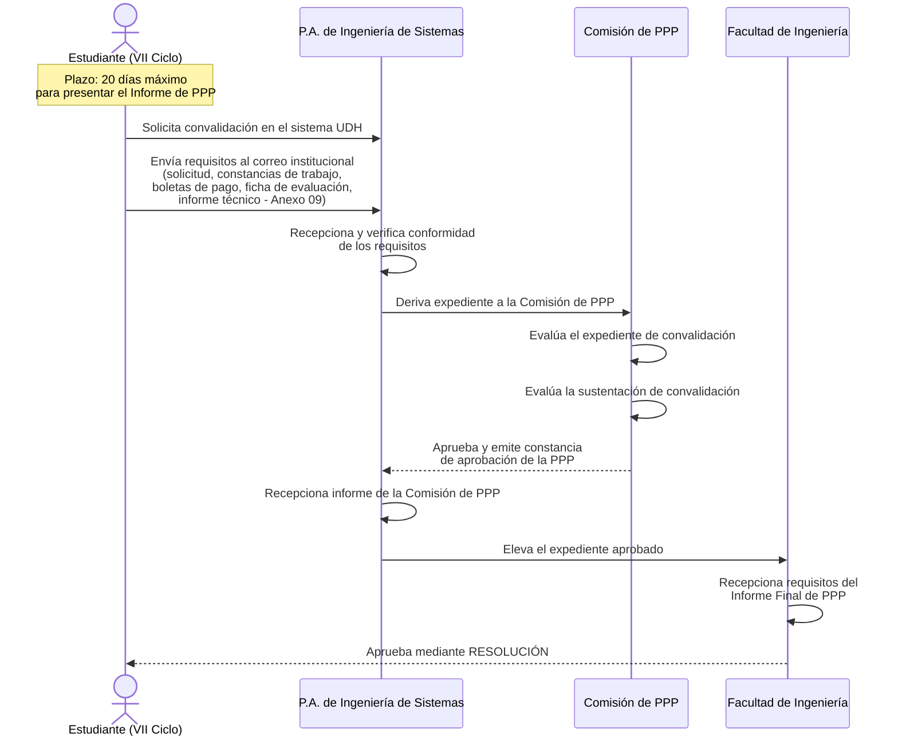

# Diagrama de Secuencia — Convalidación de Prácticas Preprofesionales (PPP)

Basado en el flujo "Requisitos para Convalidación de Prácticas Preprofesionales".

## Notas del proceso
- La convalidación excepcional aplica a quien acredite fehacientemente haber laborado (nombrado o contratado, público o privado) en labores vinculadas a la especialidad, con mínimo el sexto ciclo concluido, por no menos de 16 meses.
- El expediente requiere el visto bueno de la Comisión de Práctica Preprofesional.
