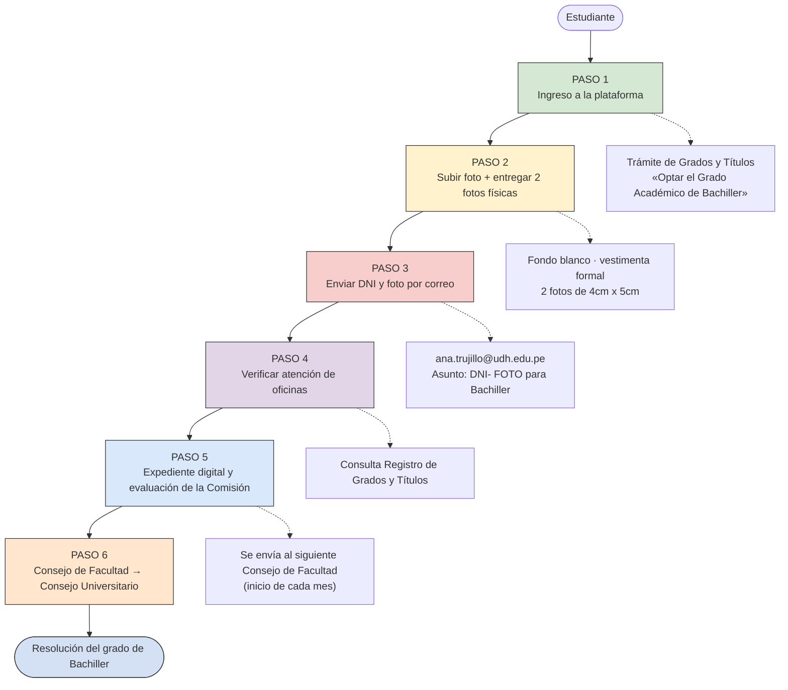
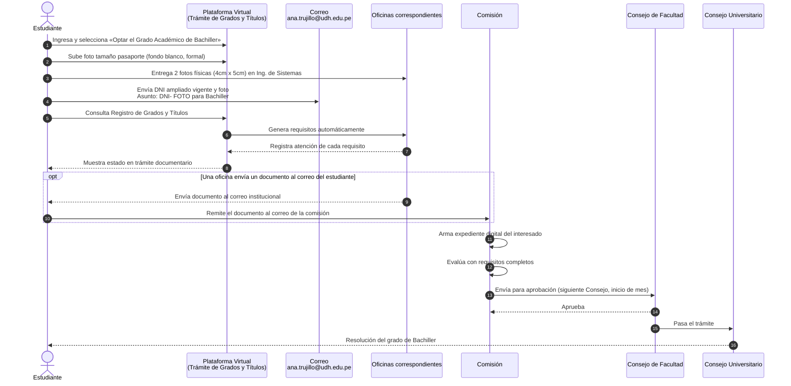

# Trámite Virtual para Optar el Grado Académico de Bachiller

> Programa Académico de Ingeniería de Sistemas e Informática — Facultad de Ingeniería, UDH
> Documento de referencia para el equipo del proyecto.
>
> **Fuentes:**
> - Flujograma oficial «Trámite Virtual de optar el Grado Académico de Bachiller» (`docs/flujograma_bachiller.jpeg`)
> - Diagrama de secuencia elaborado a partir del flujograma (`docs/secuencia_bachiller.drawio`)
>
> **Alcance:** solo se documenta lo que indica el flujograma. Lo que no aparece (plazos, montos, anexos, base reglamentaria) está listado en la sección 8 como *pendiente de confirmar*.

---

## 1. Actores

| Código | Actor | Rol |
|---|---|---|
| `EST` | Estudiante | Inicia el trámite y sube/entrega la documentación |
| `PLAT` | Plataforma Virtual (Trámite de Grados y Títulos) | Registra la solicitud y genera los requisitos automáticamente |
| `MAIL` | Correo `ana.trujillo@udh.edu.pe` | Recibe DNI y foto del estudiante |
| `OFI` | Oficinas correspondientes | Atienden cada requisito generado |
| `COM` | Comisión | Arma el expediente digital, evalúa y envía a aprobación |
| `CF` | Consejo de Facultad | Aprueba; sesiona al inicio de cada mes |
| `CU` | Consejo Universitario | Instancia final del trámite |

## 2. Datos clave

| Elemento | Detalle |
|---|---|
| Plataforma | **Trámite de Grados y Títulos** → opción *«Optar el Grado Académico de Bachiller»* |
| Foto digital | Tamaño pasaporte, fondo blanco, vestimenta formal (se sube al sistema) |
| Foto física | **2 unidades**, medida **4 cm x 5 cm**, entregadas en la oficina de Ing. de Sistemas e Informática |
| Correo de envío | `ana.trujillo@udh.edu.pe` |
| Asunto del correo | `DNI- FOTO para Bachiller` |
| Adjuntos del correo | DNI ampliado vigente + foto blanco tamaño pasaporte con vestimenta formal |
| Seguimiento | Menú Académico → **Consulta Registro de Grados y Títulos** |
| Consejo de Facultad | Se realiza **al inicio de cada mes** |

## 3. Indicaciones del flujograma

- Usar y estar al pendiente de la **cuenta institucional** (ej.: `20140505321@udh.edu.pe`).
- Verificar la atención de cada requisito en el sistema, en **trámite documentario**.
- Si alguna oficina envía un documento al correo del estudiante, **remitirlo al correo de la comisión**.

---

## 4. Vista general del proceso

---

## 5. Diagrama de secuencia completo

---

## 6. Detalle por paso

### Paso 1 — Ingreso a la plataforma
1. Ingresar a la plataforma virtual, en **Trámite de Grados y Títulos**.
2. Seleccionar **«Optar el Grado Académico de Bachiller»**.

### Paso 2 — Foto digital y física
1. Subir al sistema la foto tamaño pasaporte, fondo blanco, vestimenta formal.
2. Tener la misma foto en físico y llevarla a la oficina de Ing. de Sistemas e Informática: **2 unidades de 4 cm x 5 cm**.

### Paso 3 — Envío de DNI y foto por correo
1. Enviar **DNI ampliado vigente** y **foto blanco tamaño pasaporte con vestimenta formal**.
2. Destino: `ana.trujillo@udh.edu.pe`.
3. Asunto: `DNI- FOTO para Bachiller`.

### Paso 4 — Verificación de oficinas
1. Ingresar al menú **Académico → Consulta Registro de Grados y Títulos**.
2. Verificar la atención de cada oficina para cada requisito generado automáticamente.

### Paso 5 — Expediente digital y evaluación
1. Se arma un expediente digital con los documentos del interesado.
2. Con los requisitos completos, la **Comisión evalúa**.
3. La Comisión envía el expediente para aprobación en el **siguiente Consejo de Facultad** (se realiza al inicio de cada mes).

### Paso 6 — Consejo Universitario
Posteriormente el trámite pasa al **Consejo Universitario**.

---

## 7. Checklist del estudiante

- [ ] Ingresé a Trámite de Grados y Títulos y elegí «Optar el Grado Académico de Bachiller»
- [ ] Subí la foto tamaño pasaporte (fondo blanco, vestimenta formal)
- [ ] Entregué 2 fotos físicas de 4 cm x 5 cm en Ing. de Sistemas e Informática
- [ ] Envié DNI ampliado vigente + foto a `ana.trujillo@udh.edu.pe` con el asunto `DNI- FOTO para Bachiller`
- [ ] Reviso periódicamente mi correo institucional
- [ ] Verifico la atención de cada requisito en Consulta Registro de Grados y Títulos
- [ ] Si una oficina me envía un documento, lo remito al correo de la comisión

---

## 8. Pendiente de confirmar

Estos puntos **no figuran en el flujograma** y no se asumieron:

| Punto | Observación |
|---|---|
| Lista de requisitos generados automáticamente | El flujograma no los detalla |
| Pagos / montos | No indicados |
| Plazos por etapa | No indicados (solo que el Consejo de Facultad es al inicio de cada mes) |
| Correo de la comisión | Se menciona, pero no se indica la dirección |
| Resolución final | El diagrama de secuencia la incluye como cierre; el flujograma termina en el Consejo Universitario |
| Relación con las PPP | Las PPP son requisito del Grado de Bachiller según `procesoPPP.md`; este flujograma no las menciona |

---

*Última actualización: 30/09/2026 · Elaborado para el equipo del proyecto*
